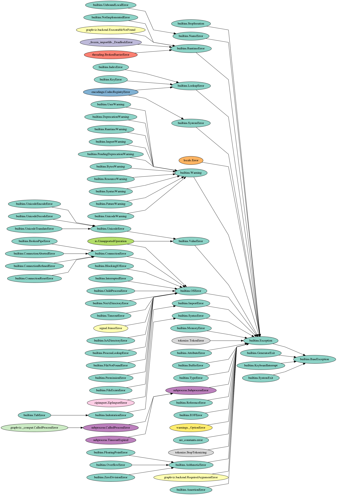
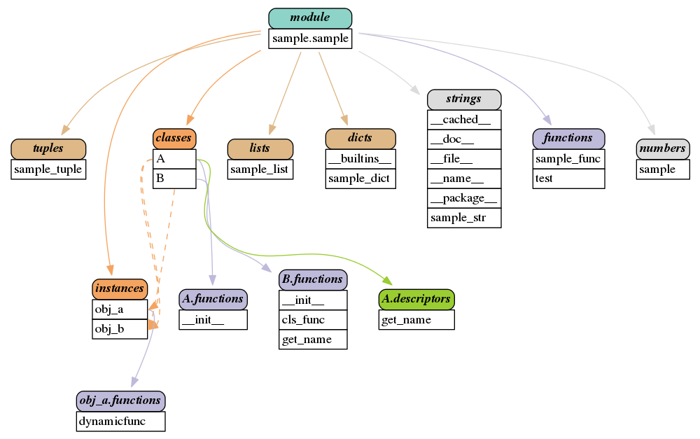
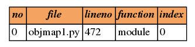

Python Object Maps
====================

Copyright (c) 2017-2018 Red Liu <lli_njupt@163.com>
Released under the MIT licence.

Python Object Maps have thre classes: 

1. ClsMap used to draw classes relationship maps like MRO, super-subclasses.
2. ObjMap used to draw a object-subobjects includeing relationship
3. StackMap used to draw a stack table in picture

Python Object Maps based on graphviz and inspect modules. 
And tested with Python 3.4.

.. figure:: sample/map.png
  :scale: 100%
  :align: center
  :alt: map

  super-subclasses relationship map example
  
.. figure:: sample/map_withmro.png
  :scale: 100%
  :align: center
  :alt: map_withmro

  super-subclasses relationship map with MRO example

  super-subclasses relationship map with BaseException

  object-subobjects includeing relationship with sample

  stack table example

